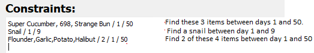

# Stardew Traveling Cart Seed Finder
Run output.py to open the GUI.

## Constraint Format
In the constraint box, add one contraint per line. Constraints have a list of items, and a day range.

The different parts of the constraint are separated by '/'.

The first part of the constraint is the list of items. It should be the in-game name(case sensitive) or the item ID. When listing multiple items, add a comma in between them. The day range is the start and end day for searching for these items. If only these 3 things are specified, this means a seed is only valid if all items are found within the day range.

If you want to list items and find seeds where at least 'X' of the items are available, you can specify this 'X' just after the item list (see the third constraint in the image. There, we want at least 2 out of the 4 items).

## Searching
Once everything is entered, click the search button. If there are any errors or issues with the inputs, it will be displayed in the output box. Otherwise, the search will start and once completed, will display how many matching seeds were found. This takes some time and may show up as "Not responding" currently, but just be patient.